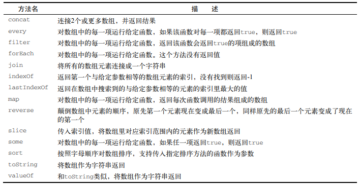

数组是**有序**的元素集合。它存储一系列同一种数据类型的值（在`js`里可以存储不同类型值，但不推荐）

### 数组的添加和删除

#### 添加

在`js`里，数组会动态的增长，在其他语言我们要决定数组的大小，创建一个全新的数组。

```js
let arr = [1,2,3,4]
arr[arr.length] = 5
```

##### push

将元素添加至末尾

##### unshift

添加至数组首位

```js
for(let i = arr.lenght;i--){
    arr[i] = arr[i-1] // 即所有元素后退
}
arr[0] = -1 // 添加的元素
```

#### 删除元素

##### pop()

删除数组末尾元素

#####shift

删除首位元素

```js
for(let i=0;i<arr.length;i++){
    arr[i] = arr[i+1] //即所有元素前进，最后删除留下的undefined
}
```

#### 任意位置的添加和删除

`splice`方法：

```js
arr.splice(3,2,4,4,4) 
```

### 二维和多维数组

不管是二维还是多维数组，都是数组的嵌套。

### javascript的数组方法



