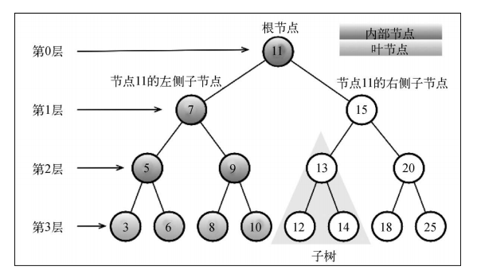
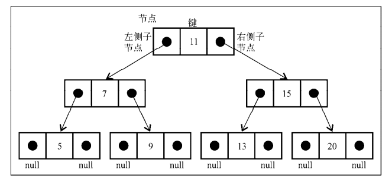

> 树是一种分层数据的抽象模型（**非顺序数据结构**）。比如公司组织架构、家谱等。

### 树的相关术语



根节点(11)：位于树顶部的节点，它没有父节点。

节点：树中的每个元素都叫节点，节点分为内部节点（至少有一个子元素）和外部节点（没有子元素）。节点类似家谱，可以有祖先和后代。

节点属性：深度，节点深度即它的祖先节点的数量。

子树：子树由节点和其后代构成（13、12和14即为一个子树），树的高度取决于所有节点深度的最大值。

### 二叉树和二叉搜索树

二叉树：其节点最多只能有两个子节点。二叉搜索树（BST）是二叉树的一种，它**只允许左侧节点存储（比父节点）小的值，在右侧节点存储（比父节点）大（或者等于）的值**。

#### 创建二叉树

首先是其结构：

```js
function BinarySearchTree(){
    let Node = function(key){
        // 和链表类似，需借助Node类来构建，首个 根节点
        this.key = key;
        this.left = null;// 左节点
        this.right = null; // 右节点
    };
    let root = null;
}
 insert(key)：向树中插入一个新的键。
 search(key)：在树中查找一个键，如果节点存在，则返回true；如果不存在，则返回
false。
 inOrderTraverse：通过中序遍历方式遍历所有节点。
 preOrderTraverse：通过先序遍历方式遍历所有节点。
 postOrderTraverse：通过后序遍历方式遍历所有节点。
 min：返回树中最小的值/键。
 max：返回树中最大的值/键。
 remove(key)：从树中移除某个键。
```

下图是一个二叉搜索树的组织方式：



通过指针来表示节点之间的关系（术语称为变边），树中的每个节点都有两个指针，一个指向左侧子节点，一个指向右侧子节点。节点本身在术语中称为键。

#### 向树中插入一个键 insert

```js
this.insert = function(key){
    let newNode = new Node();
    // 首先创建一个新的键
    if(root === null){
        root = newNode;
        //键是根节点则直接赋值
	} else {
        // 否则，insertNode插入键
        insertNode(root,newNode);
	}
}
let insertNode = function(node,newNode){
    if(newNode.key < node.key){
        if(node.left === null){
            node.left = newNode;
        }
    }
}
```

