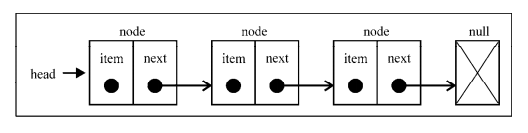

> 链表是一种动态的数据结构,他会按需进行扩容。链表存储有序的元素集合，但元素在内存中并非连续放置的。每个元素由一个存储元素本身的节点和一个指向下一个元素的引用（也称指针或链接）组成。

一个常见的链表结构如下图所示：



链表的好处在于添加或移除元素的时候**不需要移动其他元素**，但链表访问一个元素意味着需要**从起点（表头）开始迭代列表直到找到所需的元素**。

```js
Node {
  element: 15,
  next: Node { element: 10, next: Node { element: 20, next: null } } }
```


### 创建链表

```js
function LinkedList() {
    // 当一个Node元素被创建时，它的next指针总是null
    let Node = function(element) {
        // Node辅助类
        this.element = element
        this.next = null // 下一元素的指针
        // 列表最后一个节点的下一个元素始终是null。
    }
    let length = 0,
        head = null // 表头
    this.append = function(element) {}
    this.insert = function(position, element) {}
    this.removeAt = function(position) {}
    this.remove = function(element) {}
    this.indexOf = function(element) {}
    this.isEmpty = function() {}
    this.size = function() {}
    this.getHead = function() {}
    this.toString = function() {}
    this.print = function() {}
}
```

#### 向链表尾部追加元素

尾部添加元素时，要考虑链表是否为空：

```js
this.append = function(element){
    let node = new Node(element)
    let current
	if(head === null) {
        head = node
        // 若为空，直接赋值给表头，下一个node元素自动成为null
	}else {
        
        current = head
        // 我们只有第一个元素的引用，所以需要从表头head开始查找
        while(current.next){
            //current.next非null则意味着不是最后一项
            current = current.next // 循环找到链表最后一项
        }
        //此时的current就是最后一项了，将其指针指向我们添加的元素
        current.next = node
    }
    // 更改链表长度
    length++
}
```

核心点就是`current`变量的循环引用。

#### 从链表中移除元素

移除元素要考虑移除的是第一个元素或者非第一个元素。

两种`remove`方法：一种是从特定位置删除元素，第二种是根据元素值移除元素。

链表元素的删除是指：某个元素的前一个和后一个元素的指针都断了。即将`next`切断。

```js
this.removeAt = function(position) {
        if ((position > -1) & (position < length)) {
            let current = head,
                index = 0,
                previous
            if (position == 0) {
                // 此时current变量就是对列表中第一个元素的引用
                // 如果是第一项，将第二项赋值给第一项，
                // 指针断了就意味着删除 head赋给current.next，就会移除第一个元素
                head = current.next
            } else {
                while (index++ < position) {
                    // 循环赋值比较，current永远是循环列表当前元素的引用
                    // previous为前一个元素的引用
                    previous = current
                    current = current.next
                }
                //将previous与current的下一项链接起来：跳过current，从而移除它
                previous.next = current.next
            }
            length-- // {10}
            return current.element
        } else {
            return null
        }
    }
```

#### 在任意位置插入元素

和链表添加元素基本类似，同样是首位和非首位的两种情况，重点在于链表的切割，将元素插入而后衔接前后的指针。

```js
 this.insert = function(position, element) {
        let node = new Node(element)

        if (position > -1 && position <= length) {
            let current = head,
                index = 0,
                previous
            if (position === 0) {
                head = node
                node.next = current
                // 添加位置在首位，将node放在head的位置，然后把node.next指向原先的head。
            } else {
                while (index++ < position) {
                    previous = current
                    current = current.next
                }
                // 从当前元素切开链表，中间插入。首位链表指针衔接。
                previous.next = node
                node.next = current
            }
            length++
            return true
        } else {
            return false
        }
    }
```

#### indexOf

```js
this.indexOf = function(element){
    let current = head,
        index = -1;
    while(current){
        if(element === current.element){
            return index
        }
        index++;
        current = current.next;
	}
    return -1
}
```

#### remove

```js
this.remove = function(element){
    let index = this.indexOf(element)
    return this.removeAt(index)
}
```

#### isEmpty && size && getHead

```js
this.isEmpty = function(){
    return length === 0
}
this.size = function(){
    return length
}
this.getHead = function(){
 return head;
}; 
// head变量的私有性，需要用专门方法抛出
```

### 双向链表

在双向链表中，链接是双向的。一个链向下一个元素，一个链向上一个元素。


所以提现在代码层面是新增了`prev`和`tail`两个指针变量。

```js
function DoublyLinkedList(){
    let Node = function(element){
        this.element = element;
        this.next = null;
        this.prev = null //指向前一个元素的指针
    }
    let length =0,
        head = null,
        tail = null; // 链表最后一项
}
```

在双向链表中，添加元素：

```js
this.insert = function(position, element) {
    //检查越界值
    if (position >= 0 && position <= length) {
        let node = new Node(element),
            current = head,
            previous,
            index = 0
        if (position === 0) {
            //在第一个位置添加
            if (!head) {
                //链表为空的情况
                head = node
                tail = node
            } else {
                node.next = current
                current.prev = node //将当前元素的前指针指向node
                head = node
            }
        } else if (position === length) {
            //最后一项 
            current = tail // 链表最后一项next为 null
            current.next = node
            node.prev = current
            tail = node
        } else {
            while (index++ < position) {
                previous = current
                current = current.next
            }
            node.next = current 
            previous.next = node
            current.prev = node //新增元素下一元素的前链表
            node.prev = previous //新增元素的前链表
        }
        length++ //更新列表的长度
        return true
    } else {
        return false
    }
}

```

### 循环链表

循环链表可以像链表一样只有单向引用，也可以像双向链表一样有双向引用。和链表唯一的区别在于最后一个元素指向下一个元素的指针并不是`null`，而是`head`.


